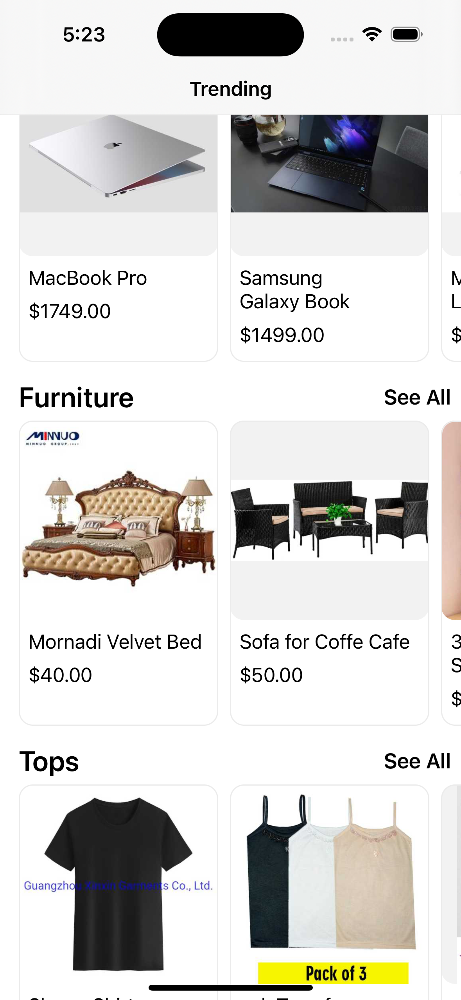
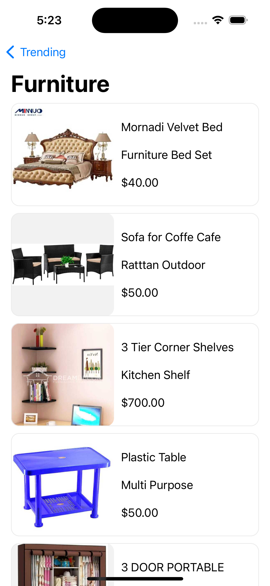
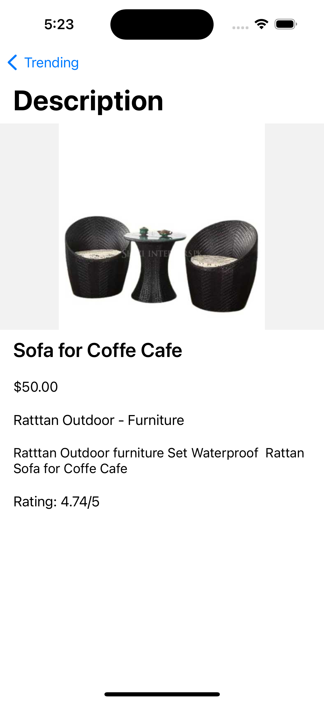

    
    <h1>Mockus</h1>
    <h3>Roger Davila</h3>
         
    

# About Mockus
Mockus is a digital storefront that lets you browse a vast collection of goods ranging from electronics to groceries. See exactly what you're looking for in an intuitive user interface!

# Architecture Design
Mockus was built using the MVC architectual pattern. The layout for the views are setup when the controllers for each specifc view is loaded. The data is populated to the view controllers when they are created.

## Home View

    

On app load, the home view controller sends a service request to the dummyJSON api. First it fetches the product category and then sends concurrent requests to get the products for each category in the database. After receving the data each section and product card is filled in with the appropriate data.

When the user wants to see more details about a product, they can click any of the product cards and then they are redirected to a detailed product view.

Also the user can select "See All" from the home screen and then navigate to a view that hold products only for a specific category.

## Category View

    

The user reaches the category view from the home page. The user is then able to browse products pertaining to a specific category. When the user clicks on a product card, they are directed to a detailed product view.

## Detailed Product View

    

When the user clicks on a product either from the home view or category view, they are direct to this view where they see more information about a product they are interested in.

## :fast_forward: Next Steps 
### Upcoming Features
- [ ] Cart Functionality
- [ ] Product Sorting
- [ ] Search for Products
